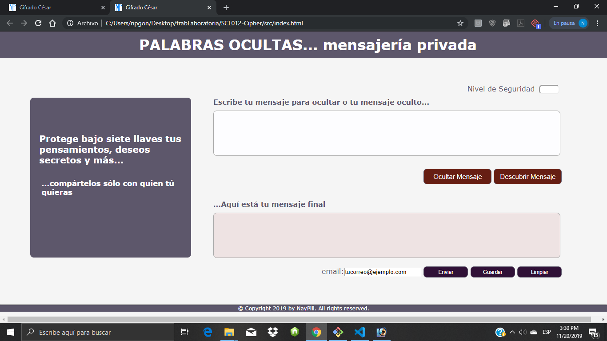
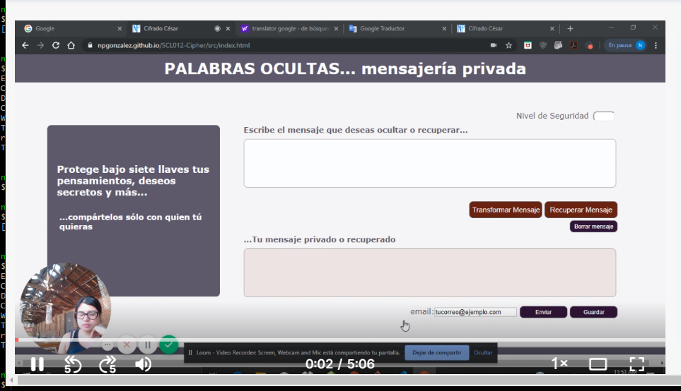

# PROYECTO CIFRADO CÉSAR

Este proyecto tiene por finalidad construir - empleando distintas herramientas UX y Front End - una aplicación de cifrado y descifrado de textos con base en el [Cifrado César](https://en.wikipedia.org/wiki/Caesar_cipher), el cual es uno de los primeros métodos de cifrado conocidos que emplea una técnica simple de sustitución, donde cada letra del texto original es reemplazada por otra que se encuentra un número fijo de posiciones (desplazamiento u offset) más adelante en el alfabeto. 
Cabe señalar que, si bien este cifrado no ofrece mucha seguridad por sí solo y los mensajes cifrados con este sistema pueden ser descifrados con facilidad, en la actualidad, es utilizado en otros sistemas más complejos de codificado (cifrado Vigenère, ROT13) 

## Aplicación [Palabras ocultas](https://npgonzalez.github.io/SCL012-Cipher/src/index.html)

La aplicación **"Palabras ocultas"** es una aplicación web que permite al usuario cifrar y descifrar textos. 

En esta, el valor de desplazamiento (offset) es seleccionado por el usuario pudiendo elevar el grado de seguridad de la codificación mediante un offset que puede tomar números tanto positivos como negativos. En el caso de seleccionar el cero, el texto a cifrar/descifrar queda escrito con sus caracteres originales.

Por ejemplo, si se usa un desplazamiento (_offset_) de 3 posiciones, para el alfabeto:

- La letra A se cifra como D.
- La palabra HOLA se cifra como KROD.
- Alfabeto sin cifrar: A B C D E F G H I J K L M N O P Q R S T U V W X Y Z
- Alfabeto cifrado: D E F G H I J K L M N O P Q R S T U V W X Y Z A B C

### Usuarios
Niños, adolescentes, jóvenes y adultos.

### Uso
Esta aplicación puede ser usadas en distintos contextos: generación de claves secretas, mensajería secreta entre personas y otros.

### Modo de empleo
#### Codificación de mensajes
- Seleccionar un nivel de seguridad (Se ingresa un número entero).

- Escribir mensaje a cifrar en área de texto superior.

- Hacer click sobre botón **Ocultar Mensaje**.

- El mensaje cifrado aparece en el área de texto inferior.

#### Descifrado de mensajes
- Seleccionar el nivel de seguridad (Se ingresa un número entero conocido por el usuario; número con el que se codificó el mensaje original). 

- Escribir mensaje a descifrar en área de texto superior.

- Hacer click sobre botón **Descubrir Mensaje**

- El mensaje descifrado aparece en el área de texto inferior.

#### Para limpiar entradas y salidas de datos en pantalla
- Hacer click sobre botón **Limpiar**.
- Desaparece datos de nivel de seguridad, y áreas de texto. 

#### Para guardar mensaje de salida
- Hacer click sobre botón **Guardar**.

- Hacer click sobre link que apareció en la parte inferior derecha de la pantalla.

- Se genera archivo txt que contiene el texto guardado y el nivel de seguridad asociado.

*Nota: El botón* **Enviar** *se encuentra desactivado; su activación queda como una posibilidad de seguir con el aprendizaje back-end.*

## Definición del producto

* El proyecto se dividió en 2 temáticas; UX Design y Front End Development.

##      - UX Design
Para el proceso de diseño se consideraron las siguientes etapas:
Descubrimiento e Investigación, Síntesis y Definición, Ideación, Prototipado y User Testing. A continuación, se entrega un resumen de las actividades realizadas en cada una de las etapas del diseño del proceso mencionadas.

### **Descubrimiento e Investigación** (Research)
- De acuerdo con los requerimientos del proyecto, se les formuló a distintos potenciales usuarios de la aplicación (amigos, conocidos, familiares, ejecutivo; personas distintas edades e intereses) – a través de redes sociales y cara a cara - las siguientes preguntas: 
- ¿En qué contexto o circunstancia utilizarías mensajes secretos?
- ¿En qué contexto o circunstancias utilizarías mensajes secretos (información confidencial), envío de mensajería?

Algunas de las respuestas: 
- Para recibir una licencia de un programa o juego, 
- En una página que guarde las claves, 
- Clave para acceder a documento, 
- Cuando realizo una transacción bancaria recibo un código por teléfono
- Temas de salud ocupacional
- Cuando comencé a enviar mensajes a espalda de mi esposa
- En caso de tener una amante, con lenguaje en claves, horas de comunicación, etc.
- Otras; en donde no se manifestó una necesidad.

A medida que se pudo establecer una mejor comunicación con el interlocutor, se fueron modificando las preguntas en cuanto a nivel de profundidad para obtener nueva información. Una preocupación del usuario, observada en estas respuestas, tenía que ver con el grado de seguridad que se podía tener en la codificación del mensaje.

También, se realizaron búsquedas en Internet con el fin de revisar algunas de las aplicaciones web de codificado/decodificado existentes y sus características.
Sitios visitados:
- http://superpatanegra.com/texto/index.php
- https://www.topster.es/texto/decodieren_encodieren.html
- https://www.convertstring.com/es/EncodeDecode/Base64Decode

En esta etapa de Research, como no se tenía claro el formato de la aplicación (web o de escritorio; móvil), también se revisó la aplicación móvil Decrypto.

### **Síntesis y Definición**
En esta etapa se analizó la información recolectada en la fase anerior tratando de encontrar elementos que permitieran entender las necesidades de los potenciales usurios del producto.

### **Ideación _ Prototipado**

#### Principales Usuarios y objetivo de estos en relación con el producto 
Los principales usuarios de este producto son todas aquellas personas que tengan la necesidad de escribir y mantener textos privados, que puedan ser leídos por ellos mismos en un momento posterior a su creación o intercambiados con otros usuarios de la aplicación. Esto se logra mediante la codificación de textos que los usuarios quieren mantener privados y decodificación, dando la posibilidad de almacenar el texto codificado para ser leído en un tiempo futuro o compartido con otros; ya que existe la opción de generar un archivo de texto que contiene el texto codificado y la clave para descifrarlo.

### **Proceso de definición del producto final**
#### Interfaz de usuario (UI)

La interfaz permite al usuario:
- Elegir un desplazamiento (_offset_) indicando cuántas posiciones quiere que el cifrado desplace cada caracter.
- Insertar un mensaje (texto) que quiere cifrar.
- Ver el resultado del mensaje cifrado.
- Insertar un mensaje (texto) a descifrar.
- Ver el resultado del mensaje descifrado.

La interfaz presenta otras funcionalidades al usuario como: 
- Borrar las entradas y salidas de texto (texto a cifrar/descifrar, texto cifrado/descifrado).
- Guardar el texto cifrado, junto con el offset en un archivo de texto a través de un link que aparece en la página.

#### Funcionalidades de la aplicación requeridas en el Proyecto
La aplicación permite al usuario:
- Cifrar y descifrar textos y visceversa determinado por un offset dado por el usuario, para el alfabeto simple (A B C D E F G H I J K L M N O P Q R S T U V W X Y Z, sin Ñ). 
- Dependiendo del offset dado por el usuario cada una de las letras es tansformada en otra letra dentro del mismo conjunto de letras mayúsculas para todos los offsets. 

#### Funcionalidades de la aplicación adicionales (extra o “Hacker edition”) 
* Cifra/descifra el alfabeto simple minúsculas y mayúsculas para un offset positivo o negativo.
* Cifra/texto con offset positivo/negativo espacios, ñ, Ñ, vocales minúsculas con acento (á,é,í,ó,ú), vocales mayúsculas(Á,É,Í,Ó,Ú),ź,Ƃ,Ɔ,ƌ,Ɠ,Ś,Ţ,Ŧ,Ŭ,ų¹,Ɗ y Ū.
* Para caracteres distintos a los mencionados anteriormente, se mantiene el caracter ingresado.

### **Test de usabilidad**
En esta sección se muestran las distintas iteraciones UX que determinaron la interfaz final del producto, señalando en cada una de ellas los aprendizajes adquiridos. 

#### Primera Iteración
A partir de la primera prueba de usabilidad, se modificó el sketch y prototipo. Se decidió hacer una interfaz más simple, con colores que pudieran ser más apropiados para un amplio rango etario de usuarios.

*Nota: En esta prueba se entrevistó a usuario pero no se registró evidencia de entrevista.*

#### Segunda Iteración
Esta prueba, además de ayudar a inspeccionar elementos de usabilidad, también permitió detectar algunos problemas de funcionalidad. Se modifica CSS para no permitir al usuario redimensionar las áreas de texto.

#### Tercera Iteración
Estas pruebas, motivaron el cambio de texto en botones para entender su funcionalidad  y orientar las acciones del usurio en el uso de la aplicación.

#### Cuarta Iteración
Las pruebas de esta última iteración sirvió para validar el producto final.

## - Desarrollo Front-End:
### HTML y CSS
- Se muestran elementos de formulario en la pantalla.

### DOM
- Se permite al usuario interactuar (**eventos del DOM**) y hacer algo cuando ocurran dichos eventos (cifrar/descifrar).
- Se actualiza la pantalla con los resultados (**manipular el DOM**).

### JS
- Se manipulan _**strings**_ (cadenas de texto).
- Se Usa **control de flujo** (bucles, condicionales, ...).
- Se **Implementan funciones** dada una descripción de su comportamiento.

### Testing
- Se verifica la implementación con **pruebas unitarias**.

## Herramientas empleadas
### UX
* Figma
* Balsamiq

### Front-End
* Visual Studio Code
* Git
* npm

# Conclusiones
En este proyecto se logró trabajar distintas habilidades blandas como técnicas. En las primeras destacan la comunicación y la empatía; mientras que, en las técnicas, el manejo de distintas herrramientas de desarrollo front-end.
En relación al producto obtenido, queda abierta la posibilidad de escalamiento, en futuras iteraciones, hasta llegar a ser parte de un sistema de comunicación de mayor potencia.
El valor agregado del producto en comparación con otros similares investigados, está en el proceso UX realizado para su construcción y la posibilidad de guar